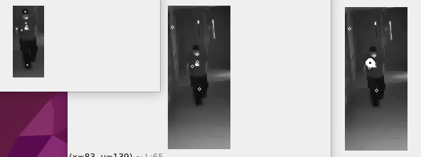
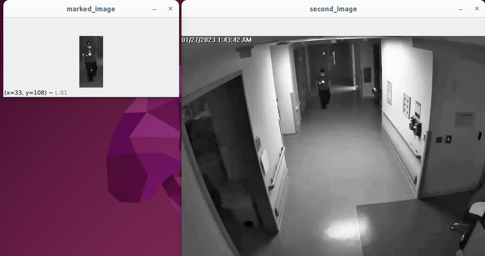
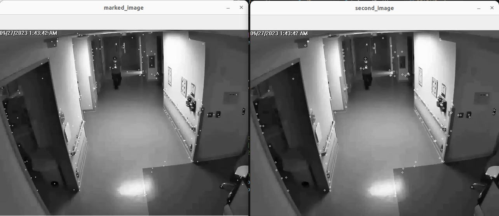
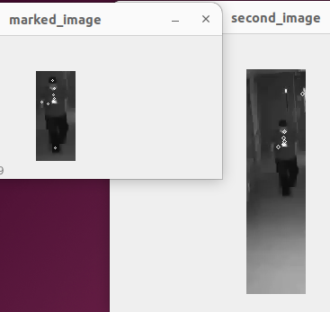
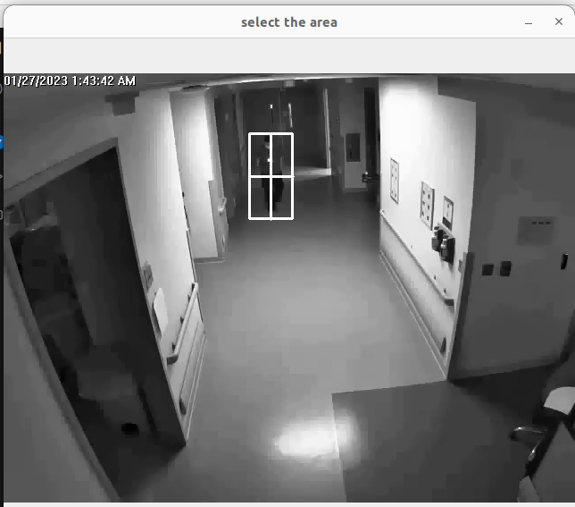

# Object Tracking Using Computer Vision
Comp Robo F23

# Project Goals
Our goal was open-endedly to gain familiarity with openCV and with computer vision, since neither of us had used either before. We framed this through object tracking and went through several small "tasks" that built on each other. For a final deliverable, we decided to use a dataset with videos from hospital security cameras to perform object tracking on healthcare workers. We ran our tests on this data, and have we have created object tracking algorithm that could be integrated into anautomated system that could potentially streamline hospital operations and monitor workflow, contributing to increased operational efficiency in healthcare settings.

We began by splitting our working into lower and higher level object detection. For the lower level track, we started with color-based object detection. For the high level decection exploration, we started with using the built in openCV tracking algorythms on single object tracking.

## Progression Map of our Learning Timeline

### Numpy Inrange
To better understand the fundamentals of how color tracking algorithms work, after implementing it with openCV, we implemented it on top of numpy. The original implementation used openCV's inRange function, which filters an image based on whether a pixel has a value within a specified range that selects for certain colors. We rewrote inRange using numpy matrix operations. We viewed this as three stacked matrix 'masks' for blue, green, and red. Each one was essentially comprised of booleans that would turn values outside the specified range into zeros.

### Higher Level Single-Person Tracking
For this model, we employ one of three advanced tracking methods—MIL, KCF, or CSRT—depending on the chosen configuration, each of which is designed to follow the object's position across a sequence of images. The MIL (Multiple Instance Learning) tracker balances between the robustness of the tracker and the computational efficiency, using a form of supervised learning that considers multiple 'instances' to update the model. The KCF (Kernelized Correlation Filters) tracker enhances efficiency by utilizing properties of circulant matrix to solve the ridge regression problem, leading to faster processing speeds. CSRT (Channel and Spatial Reliability Tracker) further improves accuracy by employing channel reliability and spatial reliability, hence providing precise tracking, particularly for objects that undergo significant scale or appearance changes, albeit with a potential trade-off in speed compared to KCF.

### SIFT Person Tracking
After experimenting with some of openCV's built-in object tracking algorithms like mean shifting, we decided to implement SIFT tracking on a set of images from a video a security camera took in a hospital showing medical professionals moving around.

#### On SIFT
SIFT stands for Scale-Invariant Feature Transform, and its main benefits are that it is both scale and rotation invariant. To start, algorithms detect extrema (such as corners, edges, and areas of high contrast) to pick out keypoints. These keypoints can be oriented to match the orientation of keypoints detected in the comparison image. This step is what makes SIFT rotation invariant. Then, each keypoint is given a descriptor, which encodes data about the values and contrasts of the pixels near the keypoint. Based on these descriptors, keypoints can be matched to one another. There are several ways to do that. One method is brute force matching which evaluates the similarity of keypoint descriptors across images using the ratio test, which quantifies the "distance" between a pair of descriptors. Whichever keypoints are the nearest to one another are assumed to be the same point in both images.

#### Our Implementation
To run SIFT, images must be loaded in as grayscale, then put through a series of functions to detect and match keypoints and descriptors:

    # find the keypoints and descriptors with SIFT
    kp1, des1 = sift.detectAndCompute(img1_roi,None)
    kp2, des2 = sift.detectAndCompute(img2_roi,None)

    # BFMatcher with default params
    bf = cv.BFMatcher()
    matches = bf.knnMatch(des1,des2,k=2)

    # # Apply ratio test
    good = []
    for m,n in matches:
        if m.distance < 0.75*n.distance:
            good.append([m])

The SIFT object, which was created earlier in the code takes in a grayscale image and returns a list of its keypoints and the corresponding descriptors. Notably, these are as keypoint objects and descriptor objects, which are specific to computer vision applications. To get information from them, you must operate on their specific properties. The brute-force matcher (BFMatcher in the code) takes in just the descriptors. It's also not specific to the sift object, because brute-force matching can be used with other methods of keypoint and descriptor detection, such as SURF. We then pick out the best matches to move forward with. Based on this method, we can load in a whole series of images and select the region of interest with the person in the first frame. By matching the keypoints of this image to the next frame in the video, you will be able to define the new region of interest from which to make keypoints for the following image, and so on. More on SIFT to follow in the design decisions section.

The leftmost image is the region of interest from the first frame, the middle image is the region of interest expanded and cropped from the second frame, and the rightmost image is the same as the middle but with the centroid or center of mass of all the matching keypoints marked with a larger circle.

In the next iteration, we redefine the ROI to be centered around the centroid of our previous image and then match it to the next image in the set. We continue this process for each pair of frames until we've made it through the video.

### Multi Person Tracking
In the context of multi-person tracking within hospital settings, we instantiate an individual tracker for each staff member detected in the initial frame, utilizing our choice of the MIL, KCF, or CSRT algorithms. For each person, a unique tracking object is created, and a bounding box is manually selected or automatically determined around them. This is achieved through a loop that initializes a new tracker instance with the `cv2.Tracker<Type>_create()` function for each bounding box. Each tracker is associated with a specific individual and is responsible for updating the position of the bounding box as the person moves across the camera's field of view. The tracking algorithm accounts for changes in appearance and position, adjusting each bounding box in subsequent frames. This collection of trackers operates concurrently, with each tracker independently updating its state without interference from the others. This allows for the simultaneous tracking of multiple individuals, paving the way for sophisticated analysis of staff movement and resource allocation in efforts to increase efficiency in healthcare facilities.

# Key Design Decisions

### SIFT
There are several ways to apply the basic process of SIFT along with brute-force matching to track a person through the frames of a video. We opted to start by choosing a region of interest in the first frame and only calculating the keyoints from that. This is computationally faster than processing the entire image before selecting the region of interest. It also results in less operations on keypoints, which we found to be more complicated than operations on the image or lists or data later in the process because of the structures of those objects. The drawback, however, was that it was much more likely to match keypoints poorly with the larger image because there were so few keypoints to work from.

Matching the small region of interest in the first frame to the entirety of the second frame results in keypoints being somewhat scattered, not concentrated on the target.

Using more context results in better matching, but it also becomes harder to work with the data because there are such a large number of keypoints, descriptors, and matches, so filtering for only the ones we want becomes more complicated.

One way we came up with to mitigate that was to match the keypoints in the first image with a smaller version of the second image. If we make the assumption that the target can't jump significantly between consecutive frames, we can crop the second image to an area that's larger than the ROI in the first image, but that excludes a lot of the image that isn't relevant to our tracker, like the rest of the room.

The second frame is cropped automatically based on the size of the original ROI.

The goal of this method was to, again, build understanding with a more conceptually focused, lower-level approach than using a full OpenCV pipeline that would run all the parts of SIFT on this format of data.

### Multi-object Tracking
We also faced a design decision regarding multi-object tracking management. Initially, we considered using OpenCV's MultiTracker_create for its simplicity in handling multiple trackers. However we decided to implement a loop that created and updated each tracker separately:

    trackers = []
    for bbox in bboxes:
        tracker = create_tracker(tracker_type)
        ok = tracker.init(first_frame, bbox)
        if ok:
            trackers.append(tracker)

In this snippet, create_tracker is a function that returns a new tracker instance based on the specified tracker_type. This approach provided us with the flexibility to handle each tracker's initialization and update cycle with fine-grained control. By individually managing the trackers, we ensured compatibility with the current OpenCV version and maintained the stability of the overall system. Although this decision increased the complexity of our tracking management code, it allowed us to proceed without the risk of broader system impacts and dependency issues.

# Key Challenges

One of the significant challenges we faced was the absence of native support for multi-object selection in the Python interface of OpenCV. OpenCV's built-in function selectROI is designed for selecting a single object, and unfortunately, it does not support the selection of multiple objects simultaneously.

To overcome this limitation, we developed a custom interface that allowed us to select multiple regions of interest (ROIs) sequentially by invoking selectROI in a loop. After each selection, we temporarily stored the bounding box coordinates in a list, and the user could press a specific key to indicate the completion of the selection process for all objects. Here's a code snippet illustrating this solution:

    # Read the first image to initialize the trackers and get the frame size
    first_frame = cv2.imread(os.path.join(image_folder, images[0]))
    if first_frame is None:
        print('Cannot read the first image')
        sys.exit()

    height, width, layers = first_frame.shape
    frame_rate = 10  # Or the actual frame rate of image sequence
    video_writer = cv2.VideoWriter(output_video_path, fourcc, frame_rate, (width, height))

    # Initialize trackers and bounding boxes
    trackers = []
    bboxes = []
    colors = []

    # Use OpenCV's selectROI to manually select bounding boxes
    while True:
        bbox = cv2.selectROI('MultiTracker', first_frame)
        bboxes.append(bbox)
        colors.append((randint(0, 255), randint(0, 255), randint(0, 255)))
        print("Press 'q' to quit selecting boxes and start tracking")
        print("Press any other key to select next object")
        k = cv2.waitKey(0) & 0xFF
        if (k == 113):  # 'q' is pressed
            break

This custom interface allowed us to manually select multiple objects in a frame, which was a key requirement for accurately initializing the tracking of hospital staff in the video data. This approach, while more cumbersome than a native multi-selection tool, proved to be a reliable workaround that did not require changes to the existing OpenCV installation.

The second major hurdle we encountered was managing the complexities of our Python environment. A significant portion of our project timeline was dedicated to managing virtual environments, adjusting Anaconda configurations, and repartitioning virtual machine virtual disks.

A more conceptual challenge we faced at the very beginning was scoping out the project and deciding on the decisions we wanted to go in. Since we had little experience with computer vision going in, it all seemed a little bit like a wild new frontier and finding a specific path we wanted to commit to within that without knowing much about the potential paths we could pick was challenging.

# Possible Future Directions

With more time to enhance our project, one significant improvement would be integrating automatic object detection to streamline the tracking initialization process. Currently, the requirement for manual selection of regions of interest (ROIs) to track objects, especially in multi-object situations, is time-consuming and subject to human error. With automated detection, we could employ advanced machine learning models, such as Convolutional Neural Networks (CNNs), to accurately and efficiently identify individuals in the first frame of the video. This would not only expedite the setup phase by eliminating the need for manual ROI specification but also increase the system's scalability and robustness.

Every time one runs the program, they must manually select where the person is in the frame.

It would also be interesting to make our implementation of SIFT more robust. For example, the size of the frame we're looking at could change when the person comes closer to the camera and thus becomes bigger. Or, we could try to use our version of SIFT to do multi-object tracking and compare its performance to that of the different built-in tracking pipelines.

# Lessons Learned

Since we were not very confident at the start of this project, splitting it up to take ownership over a particular parts was very helpful. We could sit there and take as much time with it as we needed and google as many "dumb" questions or refresh on basics as we needed without feeling pressured to go quickly or understand or keep up. That process gave us more confidence, both in our ability to use openCV and understand computer vision, but also to figure out programming issues by ourselves, since we're often not in a position to do that when doubting ourselves or working with people who are more familiar with the material.

Additionally, splitting the project into discrete, manageable segments facilitated a more organic and efficient workflow. We constructed the project in a series of distinct modules. This modular approach significantly enhanced our comprehension of each individual component, allowing for a deeper grasp of the system as a whole. It ensured that, at any pause point, we had multiple working parts in the project, showing clear progress and allowing us to adjust our targets easily. This incremental strategy proved to be more effective than pursuing a rigid, singular end-goal, allowing for adaptability and reassessment of our direction and methods.
